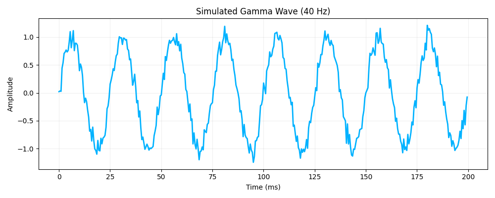
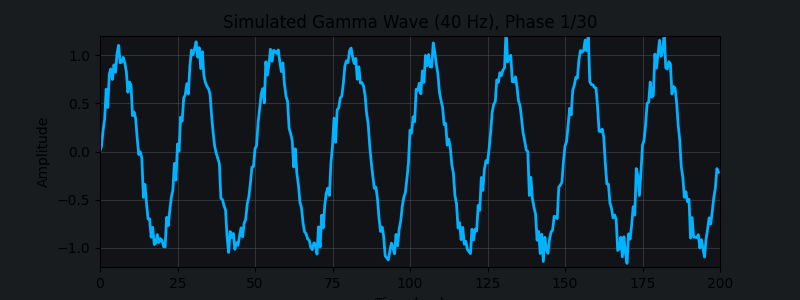

# gamma-waves

Welcome to **gamma-waves**! This repository is designed to explore, experiment with, and demonstrate concepts related to gamma wave phenomena—whether in neuroscience, signal processing, machine learning, or creative coding.

## Overview

Gamma waves are high-frequency brain waves (typically 30–100 Hz) associated with various cognitive functions, including attention, memory, and information processing. This repository will contain tools, code, and experiments to simulate, analyze, and visualize gamma waves and their applications.

## Features

- **Signal Generation**: Scripts to generate synthetic gamma wave signals.
- **Analysis Tools**: Code for frequency analysis, filtering, and visualization of gamma wave data.
- **Machine Learning**: Example notebooks for detecting or classifying gamma waves from real or simulated EEG data.
- **Visualization**: Plots and animations to help understand gamma wave behavior.

## Getting Started

1. **Clone the repository:**
   ```bash
   git clone https://github.com/standardgalactic/gamma-waves.git
   cd gamma-waves
   ```

2. **Install dependencies:**
   ```bash
   pip install -r requirements.txt
   ```
   Or follow instructions in provided notebooks for environment setup.

3. **Run an example:**
   ```bash
   python simulate_gamma.py
   ```


## Output should be:




## Folder Structure

```
gamma-waves/
├── data/                # Sample datasets (real or synthetic)
├── notebooks/           # Jupyter notebooks for exploration and ML
├── scripts/             # Python scripts for signal processing
├── visualization/       # Tools for plotting and animation
├── README.md            # This file
└── requirements.txt     # List of dependencies
```

## Contributing

Contributions are welcome! Feel free to open issues or submit pull requests for:

- Bug fixes or improvements
- New analysis or visualization tools
- Additional documentation

Please see [CONTRIBUTING.md](CONTRIBUTING.md) for more details.

## License

This project is licensed under the MIT License. See [LICENSE](LICENSE) for details.

## Acknowledgments

- [Wikipedia: Gamma Waves](https://en.wikipedia.org/wiki/Gamma_wave)
- Open-source signal processing libraries (e.g., NumPy, SciPy, MNE)
